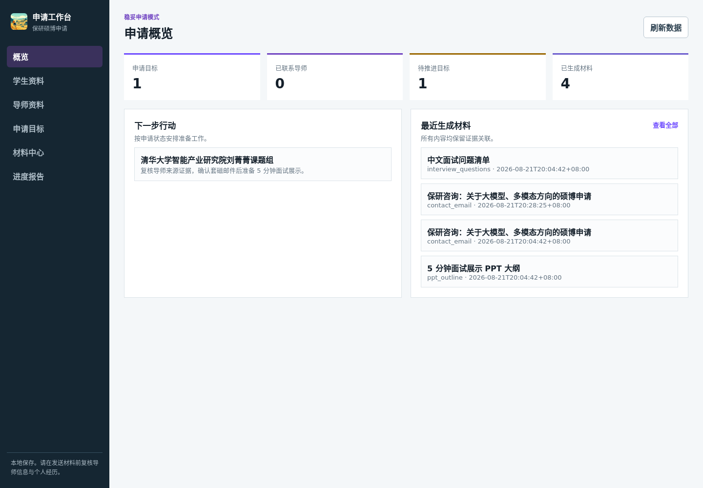
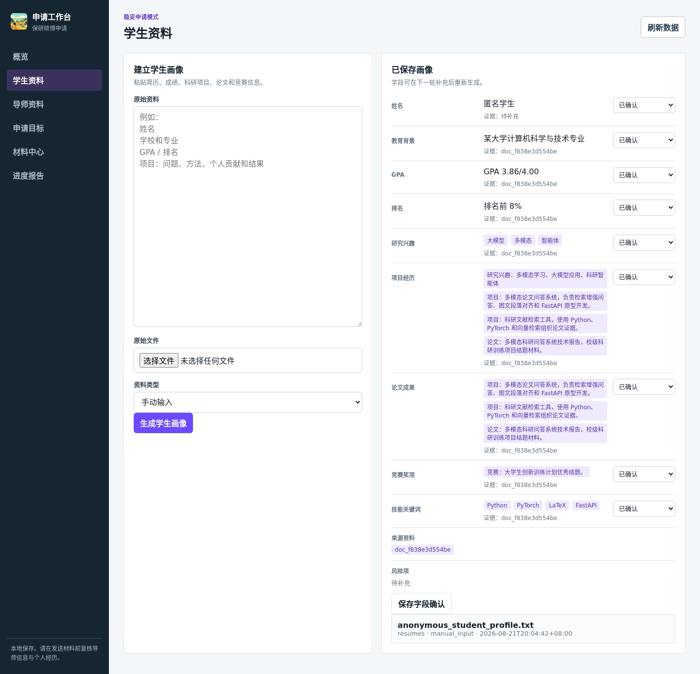
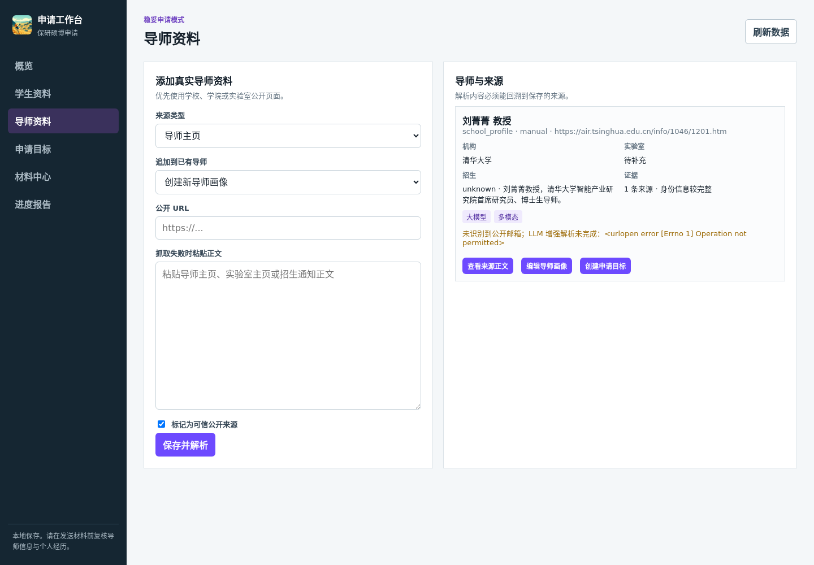
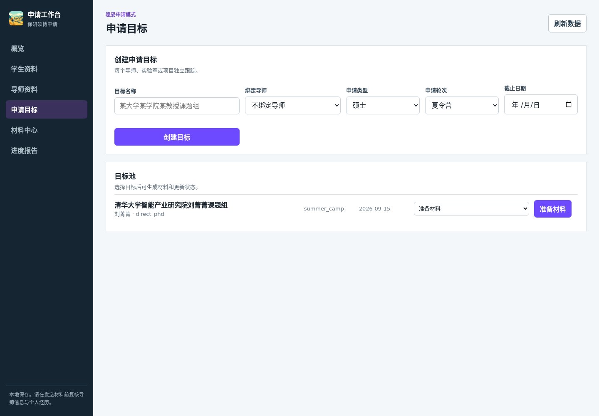
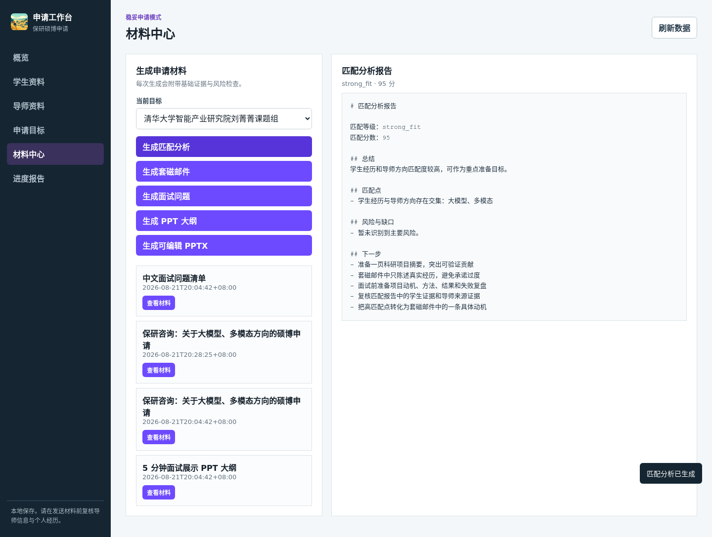
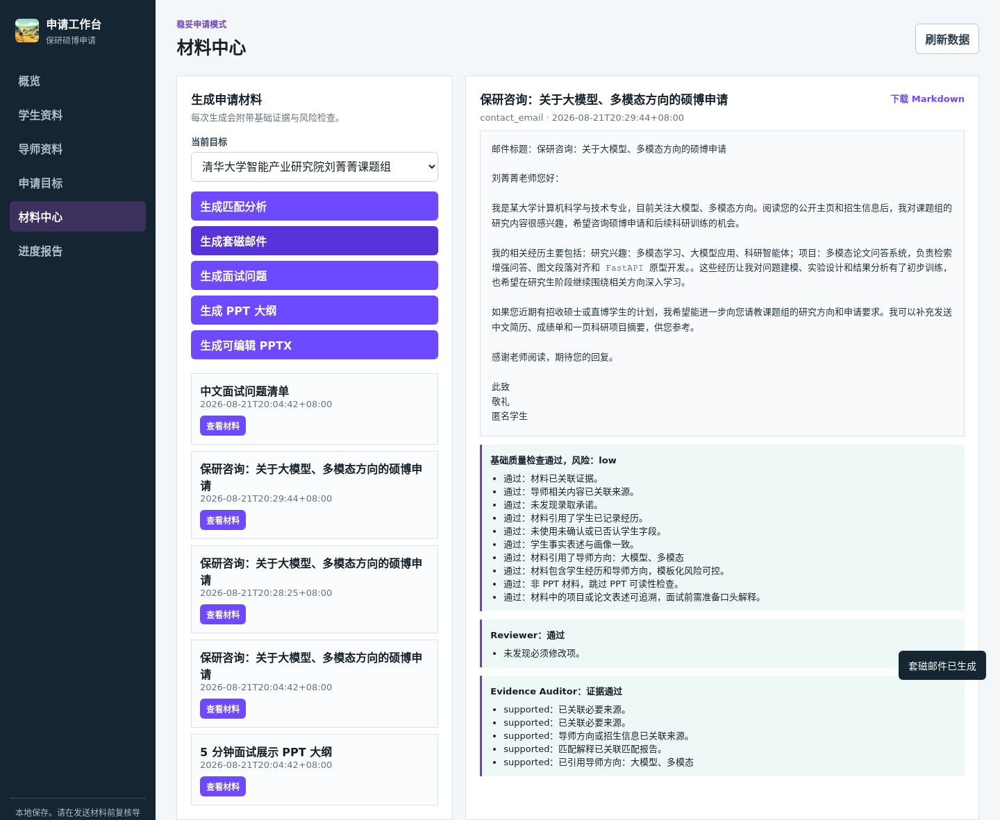
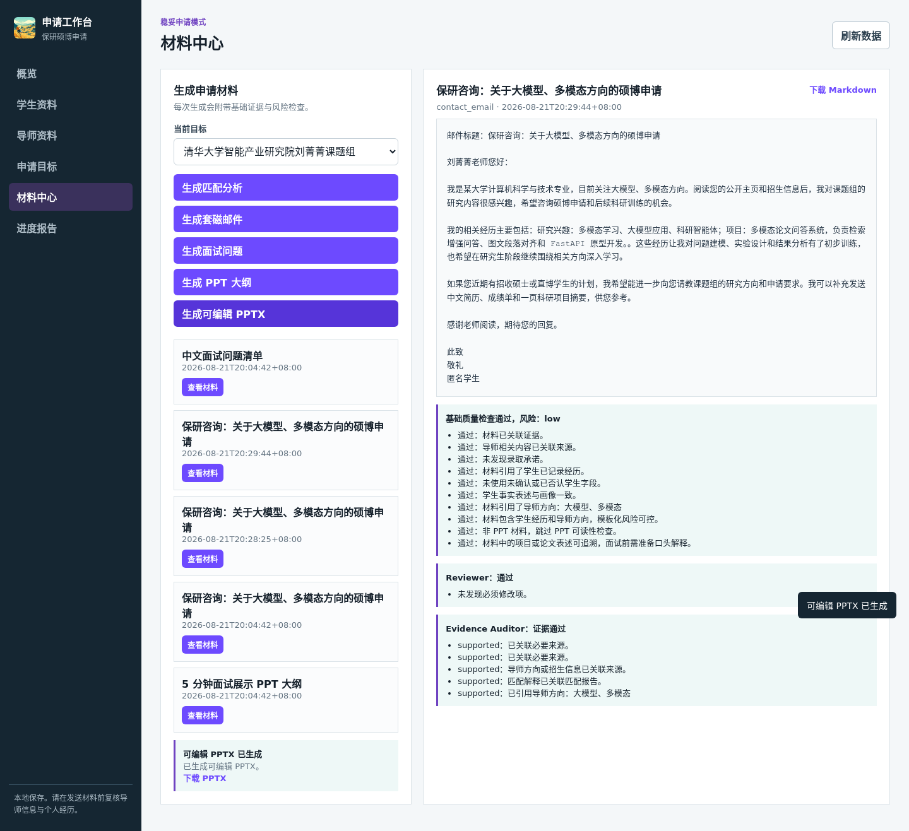
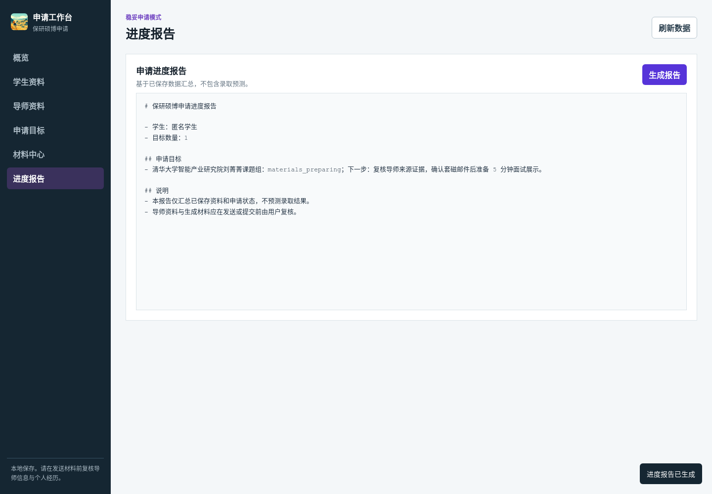

# Demo Walkthrough

这份说明用于快速展示 Offer Harvester 的核心闭环：从学生资料、导师来源、申请目标，到匹配分析、材料审查、PPTX 生成、申请生命周期和进度报告。

演示数据来自 `workspace.demo/` 的匿名样例。学生信息为虚构匿名资料；导师来源使用公开网页摘要和来源链接。真实学生资料、API key、真实套磁邮件和个人隐私数据不应进入 Git。

## 演示主线

```text
学生资料落盘
-> 字段级证据与确认
-> 导师公开来源采集
-> 创建申请目标
-> 生成匹配分析
-> 生成套磁邮件并通过 reviewer / auditor
-> 生成可编辑 PPTX 并记录 PPT 质量
-> 归档申请状态和邮箱候选信号
-> 输出申请进度报告
```

## 1. 申请概览



首页展示当前申请目标、已联系导师、待推进目标和已生成材料。它不是营销页，而是进入实际申请工作流的操作台。

这个页面用于回答两个问题：

- 现在有哪些申请目标需要推进
- 最近生成过哪些材料，是否需要继续复核

## 2. 学生画像与字段证据



学生资料可以来自本地上传或手动粘贴。原始资料会先保存到 `workspace/user_documents/`，再抽取成结构化 `StudentProfile`。

字段级确认状态包括：

- `unconfirmed`：可用于草稿，但必须在质量报告中提示
- `confirmed`：用户已确认，可作为可靠事实
- `rejected`：用户否认，生成材料时禁止主动使用
- `needs_review`：证据不足或存在冲突，需要复核

这一步的重点是避免把未确认事实直接写成正式申请材料。

## 3. 导师来源与画像



导师资料优先来自学校、学院、实验室或招生通知等公开来源。URL 抓取失败时，用户可以手动粘贴正文作为兜底。

导师画像会记录：

- 来源类型和抓取状态
- 导师姓名、学校、学院、职称、实验室
- 研究方向、招生要求、代表论文和风险提示
- 来源证据数量和身份确认状态

系统的约束是：导师方向、招生要求和匹配结论必须能追溯到来源。

## 4. 申请目标追踪



从导师画像可以创建申请目标，并记录申请类型、申请轮次、截止日期、当前状态和下一步行动。

目标池承担后续材料生成的上下文入口。匹配分析、套磁邮件、面试问题和 PPT 都围绕某个具体目标生成。

## 5. 匹配分析报告



匹配分析不是录取概率预测，而是稳妥型申请判断。报告会输出：

- 匹配等级和分数
- 学生经历与导师方向的匹配点
- 风险与缺口
- 下一步建议

后续材料生成会引用匹配报告，避免套磁邮件只写泛泛的“我对您的方向很感兴趣”。

## 6. 材料质量审查



套磁邮件生成走 `MaterialDraftAgent -> MaterialReviewAgent -> EvidenceAuditAgent` 主链路。

质量区域展示三层结果：

- 基础质量检查：材料是否关联证据、是否过度承诺、是否模板化
- Reviewer：检查空泛、夸大、导师方向不贴合和面试不可解释
- Evidence Auditor：逐项检查材料声明是否来自学生画像、导师来源或匹配报告

这一步是本项目从普通材料生成器变成可审计 Agent 工作流的关键。

## 7. 可编辑 PPTX 下载与 PPT 质量



当前 MVP 使用本地 `LocalPptxAdapter` 生成可编辑 PPTX，适合面试展示场景。材料中心也提供参考 PPTX 上传和规则预检：参考文件会保存 hash、页数、元素数量和功能页检查结果；当前阶段默认仍降级到本地可编辑 PPTX，不直接套用外部模板。

PPT 生成任务会记录：

- 目标页数、展示时长和文字详略参数
- 使用的生成引擎
- fallback 原因
- Content / Design / Coherence 规则评分
- 可下载的 `.pptx` 文件

当前边界：

- 可以生成并下载可编辑 PPTX
- 不复制 PPTAgent 外部项目源码
- 参考 PPT 模板只做预检和 fallback 提示，不做复杂版式学习
- 外部 PPTAgent 运行时暂未作为 MVP 必需能力
- PPTAgent 中的 ViT / vision 页面理解能力保留为未来可选外部能力，不进入主项目默认依赖
- 默认不引入 `torch`、ViT 模型权重或本地视觉推理栈

## 8. 申请生命周期与邮箱信号

申请目标可以创建 archive，保存目标快照、申请状态、提交材料快照、沟通草稿、outcome 和 lessons。

生命周期面板支持：

- 创建申请归档
- 生成 follow-up 草稿
- 生成 thank-you note 草稿
- 检查只读邮箱同步骨架
- 粘贴邮件文本并识别候选信号
- 用户确认后才把邮件信号写入 tracker / archive / outcome

邮箱信号第一版不接真实 Gmail / QQ OAuth，只识别用户粘贴或 fixture 邮件文本。候选信号会记录主题、发件人、日期、匹配目标、短摘要和 source hash。未匹配或冲突信号只进入人工复核列表。

支持识别的信号包括：

- 导师回复
- 夏令营通知
- 预推免或面试邀请
- 补材料要求
- 拒信
- offer / waitlist

## 9. 申请进度报告



进度报告汇总本地 workspace 中的画像、导师、目标、材料和状态记录，用于复盘当前申请准备情况。

报告不包含录取概率预测，也不替代用户人工判断。它的作用是帮助用户知道哪些材料已生成、哪些事实仍需确认、哪些目标还要推进。

## RAG 证据检索层

RAG 已作为轻量证据检索层接入，而不是简单扩大 LLM 上下文。检索结果返回来源、时间戳和证据 ID，供 drafter、reviewer、auditor、匹配分析、面试问题和 PPT 大纲使用。

RAG 会覆盖三类知识：

- 学生资料证据：本地上传/粘贴资料、结构化画像、字段确认状态
- 导师与目标证据：导师公开来源、导师画像、申请目标、匹配报告
- 保研推免常识：推免流程、常见材料、院校政策、申请截止日期、面试准备 FAQ

截止日期、政策和流程类信息必须记录来源 URL、适用年份和更新时间。过期信息只能作为历史参考，不能直接作为当前申请建议。

## Source Connector Live Test

来源连接器页面现在区分三种状态：

- manifest 合法：字段映射、访问规则和 fallback 已通过静态校验
- live test 通过：用户确认遵守 robots/ToS，公开测试 URL 返回可读取页面
- 可注册：只有 live test 通过后才会出现

live test 只保存 URL、HTTP 状态、内容类型、响应大小、响应 hash、robots 状态和失败原因，不保存网页正文。网络失败或规则不允许时，继续使用手动粘贴正文兜底。

通过后的 connector 默认 7 天后进入 `stale`，不再显示为可注册；用户可以在策略面板手动刷新，也可以运行：

```bash
python tools/refresh_source_connectors.py --list-due
python tools/refresh_source_connectors.py --connector-id advisor_homepage_generic_zh --url https://example.edu/faculty/a --ack-tos
```

模板 registry 还支持用户模板的 Markdown/纯文本编辑、版本 diff 和启停状态管理。PDF 可读性检查位于材料中心，只检查已有 PDF，不负责生成 PDF；扫描件会提示 `needs_ocr`。

## Release Polish 说明

README、CHANGELOG 和 GitHub Release Notes 的整理规范见 [README / Release Polish Reference](14_release_readme_polish_reference.md)。当前项目不会展示不存在的 PyPI、npm、Docker、downloads 或 citation badge。

## 复现截图

先启动 demo 服务：

```bash
cd app/backend
WORKSPACE_DIR=/home/bubble/agent/grad-apply-workflow/workspace.demo ../../.venv/bin/uvicorn main:app --host 127.0.0.1 --port 8001
```

然后在项目根目录运行截图脚本：

```bash
python3 tools/capture_demo_screenshots.py --base-url http://127.0.0.1:8001 --output-dir docs/assets/demo
```

截图脚本依赖本地 Playwright。它只用于展示素材更新，不是后端运行时依赖。
